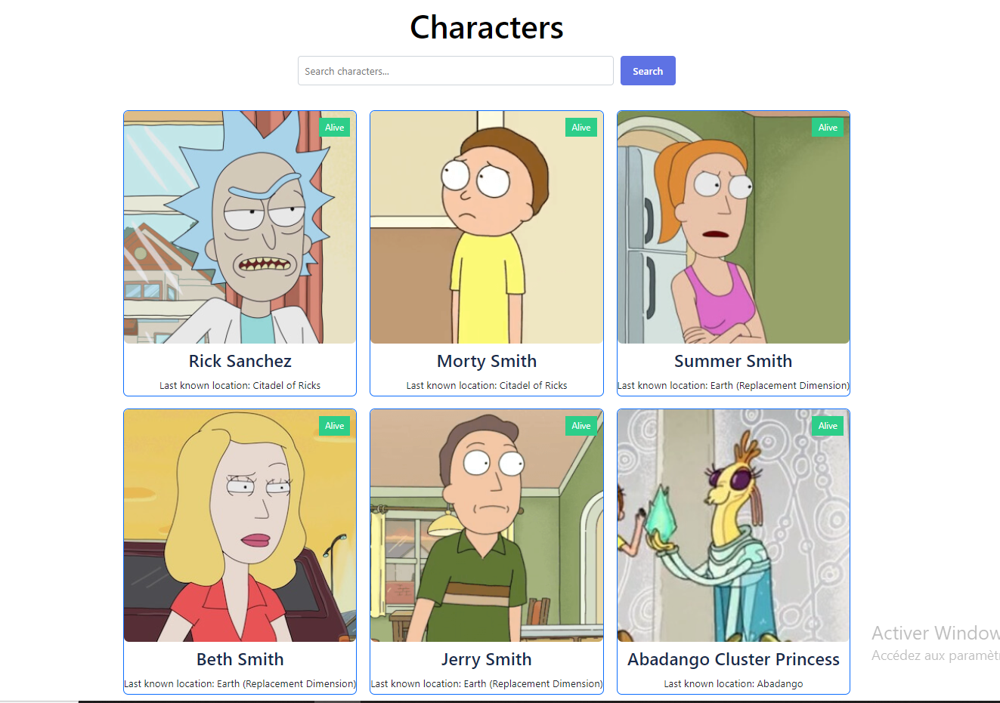
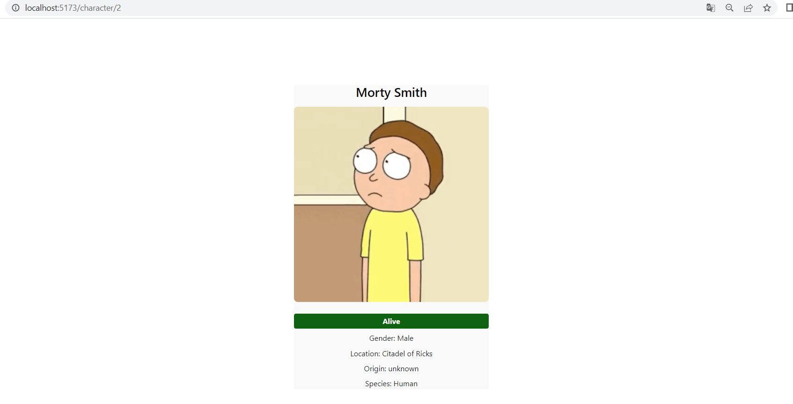

# Front-application-Internship-Junior-Level-DANUBIO

This is a front-end project that demonstrates a **React + Vite** application for an internship/junior-level front-end developer position at Danubio. The application fetches and displays details of characters from the popular show *Rick & Morty* using the [Rick and Morty API](https://rickandmortyapi.com/).

## Description

The application allows users to search for characters from the *Rick & Morty* universe. When a character is selected, users can view detailed information including their name, image, species, status, gender, and location. The app has two main views:

- **Home**: Displays a grid of characters with search functionality.
- **Character Detail**: Displays detailed information about a specific character when clicked.

## Features

- **Search for characters by name**: Users can search for characters from the *Rick & Morty* universe.
- **View character details**: Upon clicking a character, users can see details like name, image, status, gender, species, and location.
- **Responsive design**: The application is designed to be mobile-friendly and works well on different screen sizes.
- **Easy-to-use interface**: An intuitive user interface makes the app simple to navigate.

## Screenshots

### Home View:


### Character Detail:


## Prerequisites

Before running the app, ensure you have the following tools installed:

- [Node.js](https://nodejs.org/)
- [npm](https://www.npmjs.com/)

## RUNNIG THE PROJECT 

npm run dev

## Installation

To get started with this project, follow these steps:

1. Clone this repository:
   ```bash
   git clone https://github.com/yourusername/front-application-internship-junior-level-danubio.git
